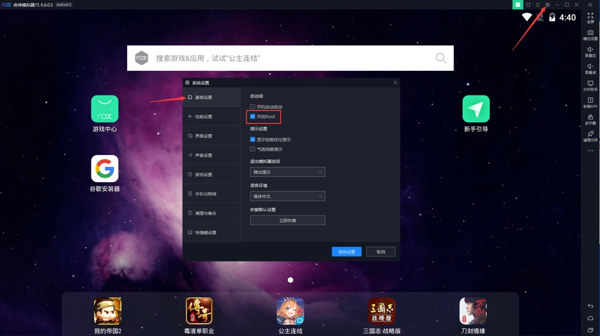
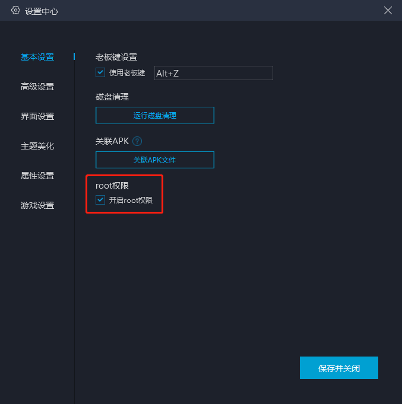

# 安卓模拟器root

Android逆向期间，如果要逆向的app，可以在安卓模拟器中正常安装和运行，那么，其实使用模拟器去折腾，也是一个比较好的选择，因为：

安卓的root权限，对于多数安卓模拟器来说，都能很方便的支持，毕竟基本上就是一个参数的开启的事情。

目前已知的，相对还算好用的安卓模拟器，且支持root的有：

* [夜神Nox](https://book.crifan.org/books/good_android_emulator_nox/website/)
  * 
* 网易Mumu
  * https://mumu.163.com/
    * 
