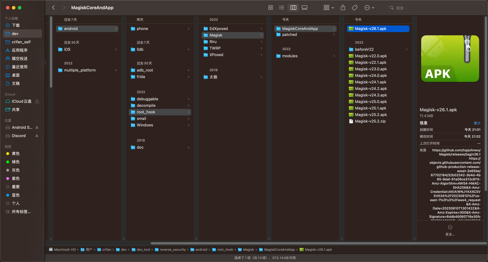

# 下载和安装最新版Magisk

此处最新版是`v26.1`，所以去 [Release Magisk v26.1 · topjohnwu/Magisk (github.com)](https://github.com/topjohnwu/Magisk/releases/tag/v26.1)，找到：

https://github.com/topjohnwu/Magisk/releases/download/v26.1/Magisk-v26.1.apk

并下载，得到：`Magisk-v26.1.apk`



然后下载到安卓手机Pixel5中：

```bash
adb push Magisk-v26.1.apk /sdcard/Download/
```

再去用文件管理器`文件极客`去安装：点击下载目录中的`Magisk-v26.1.apk`：


去安装，即可。