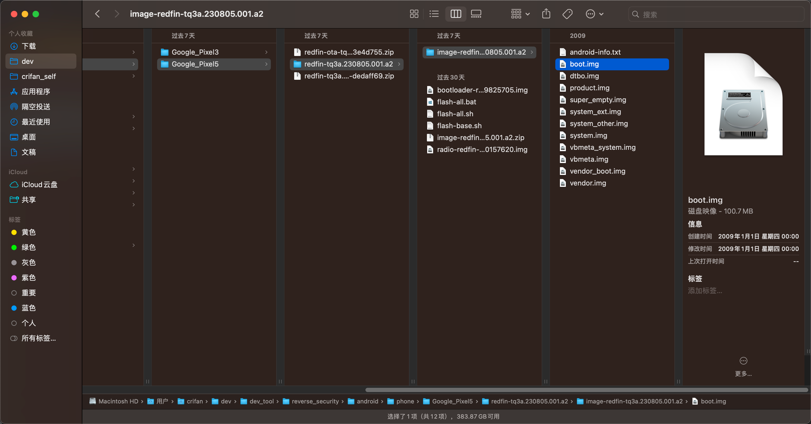

# 找到要打补丁的boot.img文件

对于后续Magisk的root来说，需要找到：要打补丁的`boot.img`文件：

先去从Android官网，下载适配当前安卓手机`Google`的`Pixel5`的镜像image：

* [Nexus 和 Pixel 设备的出厂映像  |  Google Play services  |  Google for Developers](https://developers.google.cn/android/images)
  * https://developers.google.cn/android/images

->

https://dl.google.com/dl/android/aosp/redfin-tq3a.230805.001.a2-factory-dedaff69.zip?hl=zh-cn

下载得到：`redfin-tq3a.230805.001.a2-factory-dedaff69.zip`

解压得到得到文件夹：`redfin-tq3a.230805.001.a2`

找到：`redfin-tq3a.230805.001.a2/image-redfin-tq3a.230805.001.a2`中的（96MB的）`boot.img`

就是我们后续要打补丁的文件了。
