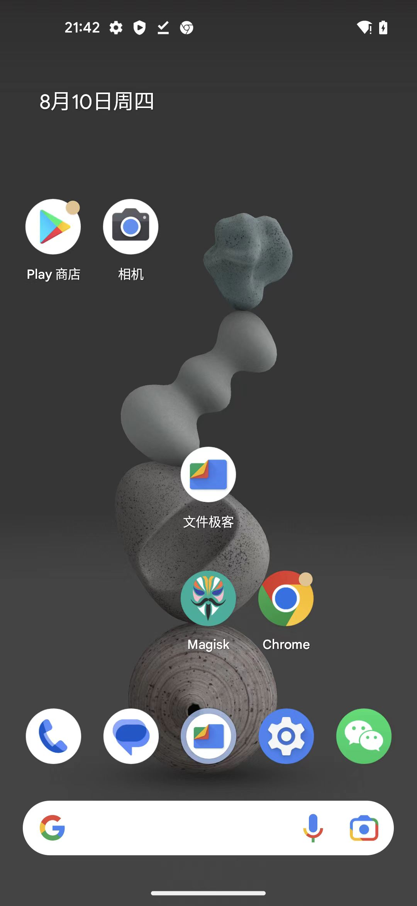
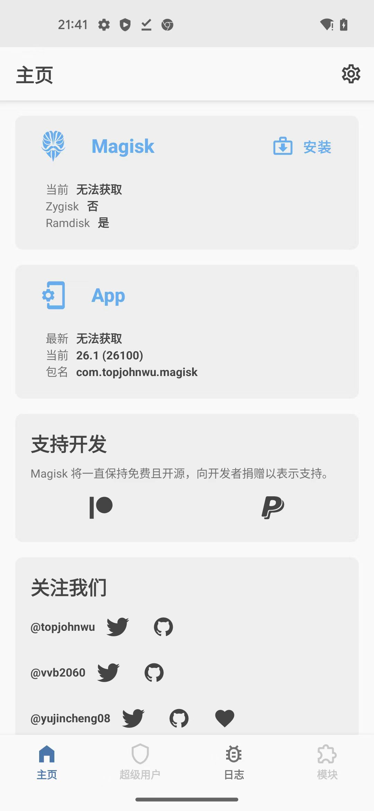
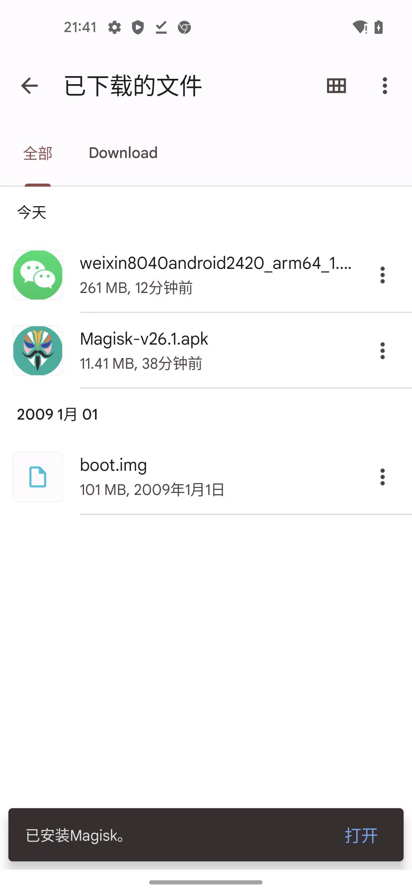
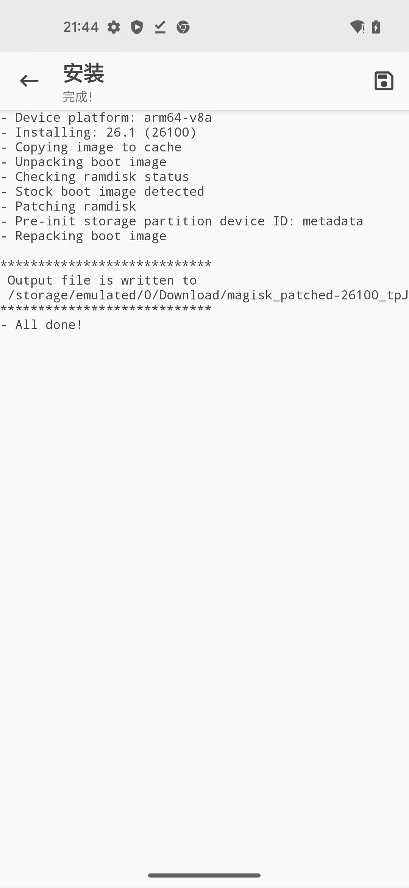

# 用Magisk去给boot.img打patch

先去从Android官网，下载适配当前安卓手机Pixel5的镜像image：

* [Nexus 和 Pixel 设备的出厂映像  |  Google Play services  |  Google for Developers](https://developers.google.cn/android/images)
  * https://developers.google.cn/android/images

->

https://dl.google.com/dl/android/aosp/redfin-tq3a.230805.001.a2-factory-dedaff69.zip?hl=zh-cn

下载得到：`redfin-tq3a.230805.001.a2-factory-dedaff69.zip`

解压得到得到文件夹：`redfin-tq3a.230805.001.a2`

找到：`redfin-tq3a.230805.001.a2/image-redfin-tq3a.230805.001.a2`中的（96MB的）`boot.img`


将其下载到Pixel5手机中（的下载目录）：

```bash
adb push boot.img /sdcard/Download
```

再去Magisk中：

* 概述：`Magisk`->`安装`->`选择并修补一个文件`->（从下载目录中）选择`boot.img`->`开始`->`完成`->输出log中会有打了patch的`boot.img`
* 详解：
  * 点击打开Magisk
    * 
  * 点击Magisk中的主页中的：安装
    * 
  * 选择并修补一个文件
  * （从下载目录中）选择`boot.img`
    * 
  * 开始
  * 完成
    * 
  * 输出log中会有打了patch的`boot.img`
    ```bash
    Output file is written to 
    /storage/emulated/0/Download/magisk_patched-26100_bMrsR.img
    ```
    * 其中：
      * `/storage/emulated/0/Download/magisk_patched-26100_bMrsR.img`
        * == `/sdcard/Download/magisk_patched-26100_bMrsR.img`
      * 就是我们要的，打好了`patch`的`boot.img`
