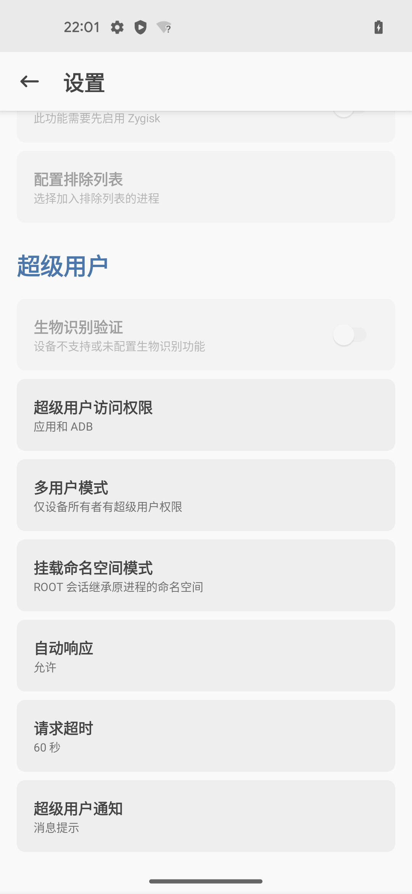

# Magisk中root相关设置

此时已经实现了用Magisk给安卓13的Pixel5去root，已获取到root权限了。

而后续其他内容想要去获取root权限，则就是通过Magisk去管理和授权了。

为了让其他内容更方便的获取root权限，则去改动Magisk中root相关的设置：

Magisk中，关于获取root权限的默认设置是：

* 超级用户
  * 自动响应：`提示`
    * 别的内容，想要请求root权限时，是会弹框提示
      * 需要你自己手动去点击允许，对方才能获取到root权限
  * 请求超时：`10秒`
    * 如果不小心超时了（比如我之前就是为了截图记录过程，而导致），超过了此处的默认设置的10秒，则就表示拒绝了，对方就无法获取到root权限了

去改为：

* 超级用户
  * 自动响应：`允许`
    * 无需手动干预，自动允许获取root权限
      * 则此时：其实后续的参数：`请求超时`则就没意义=不起作用了=用不到这个设置了
  * 请求超时：`60秒`
    * 把超时时间改的足够的长，方便能来得及操作
