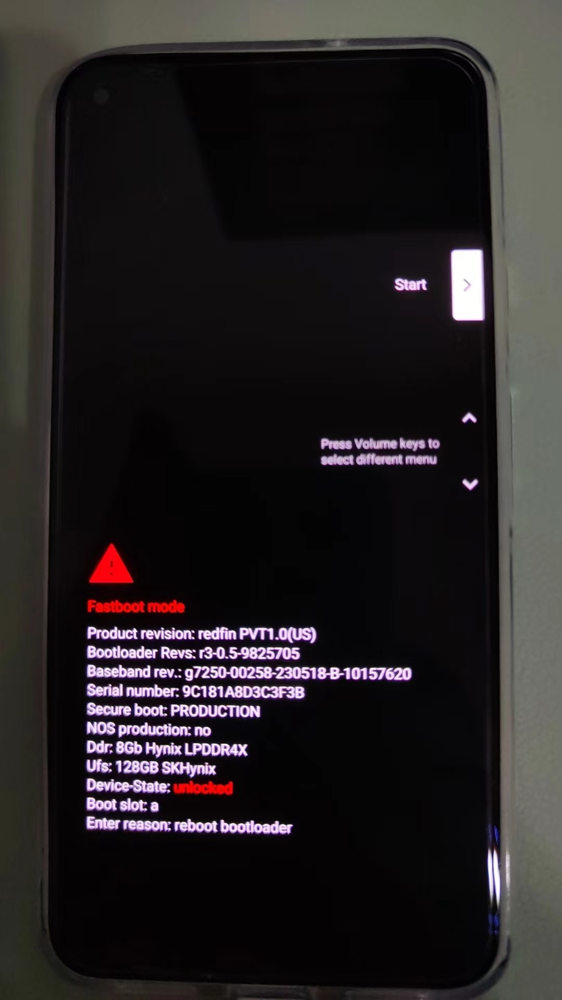
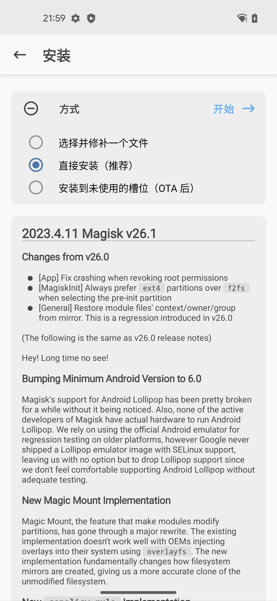
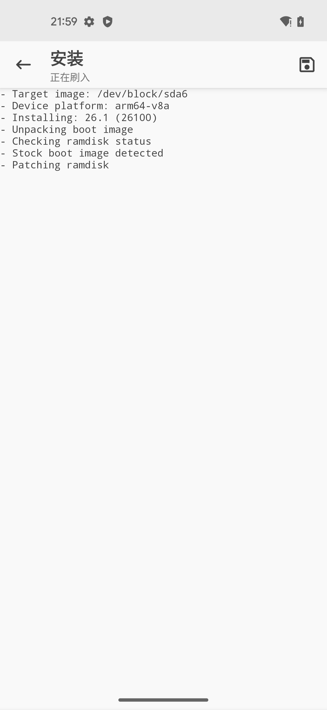
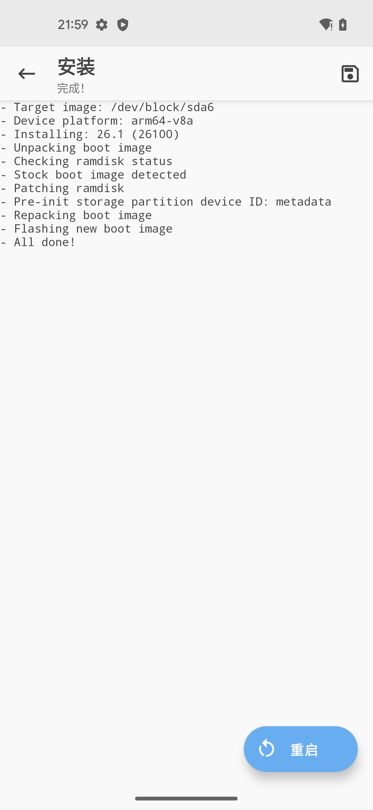
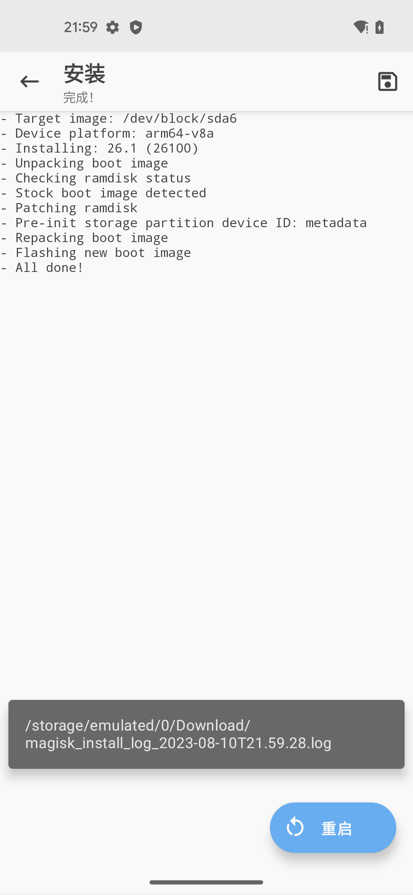

# 用Magisk写入patch后的boot.img

## 先临时写入patch后的boot.img，启动系统，使得Magisk有了root权限

（1）先：进入Fastboot模式：

```bash
adb reboot bootloader
```
重启后，手机进入Fastboot Mode:



注：

* 最好再用命令`fastboot devices`确认的确进入了Fastboot mode == 可以找到Fastboot的设备
  ```bash
  ➜  GooglePixel5 fastboot devices
  9C181A8D3C3F3B     fastboot
  ```

（2）再：（此处是临时）写入用Magisk打了patch的boot.img

```
fastboot boot magisk_patched-26100_tpJTt.img
```
* 说明
  * `magisk_patched-26100_tpJTt.img`是之前用Magisk`打了patch后的boot.img`
  * 输出举例
    ```bash
    ➜  GooglePixel5 fastboot boot magisk_patched-26100_tpJTt.img
    Sending 'boot.img' (98304 KB)                      OKAY [  2.447s]
    Booting                                            (bootloader) boot.img missing cmdline or OS version
    OKAY [  1.591s]
    Finished. Total time: 4.077s
    ```

## 再用Magisk去永久写入（patch后的boot.img）

* 概述：`Magisk`->`安装`->`直接安装（推荐）`->`开始`->`重启`
* 详解
  * `Magisk`->`安装`
    * 
  * `直接安装（推荐）`
    * 
  * `开始`：正在刷入
    * 
  * `重启`
    * 

->效果：

重启后，Magisk就拥有了root权限了

-> 就成功实现了，用Magisk给Android13的Pixel5去root了

* 具体表现是：Magisk中的`超级用户`和`模块`2个tab页，不是灰色
  * 
    * 都可以点击进去了
      * 超级用户=root
        * 
      * 模块
        * 


### 附录：相关log日志

点击右上角的保存按钮：



可以保存出日志，导出到电脑：

```bash
➜  GooglePixel5 adb pull /sdcard/Download/magisk_install_log_2023-08-10T21.59.28.log .
/sdcard/Download/magisk_install_log_2023-08-10T21.59.28.log: 1 file pulled, 0 skipped. 0.3 MB/s (1942 bytes in 0.006s)
```

查看到日志内容：

* `magisk_install_log_2023-08-10T21.59.28.log`

```log
- Target image: /dev/block/sda6
- Device platform: arm64-v8a
- Installing: 26.1 (26100)
Parsing boot image: [/dev/block/sda6]
HEADER_VER      [3]
KERNEL_SZ       [11721709]
RAMDISK_SZ      [1967466]
OS_VERSION      [13.0.0]
OS_PATCH_LEVEL  [2023-08]
PAGESIZE        [4096]
CMDLINE         []
- Unpacking boot image
KERNEL_FMT      [lz4]
RAMDISK_FMT     [lz4_legacy]
VBMETA
Loading cpio: [ramdisk.cpio]
- Checking ramdisk status
- Stock boot image detected
- Patching ramdisk
- Pre-init storage partition device ID: metadata
Loading cpio: [ramdisk.cpio]
Add entry [init] (0750)
Create directory [overlay.d] (0750)
Create directory [overlay.d/sbin] (0750)
Add entry [overlay.d/sbin/magisk32.xz] (0644)
Add entry [overlay.d/sbin/magisk64.xz] (0644)
Add entry [overlay.d/sbin/stub.xz] (0644)
Patch with flag KEEPVERITY=[true] KEEPFORCEENCRYPT=[true]
Loading cpio: [ramdisk.cpio.orig]
Backup mismatch entry: [init] -> [.backup/init]
Record new entry: [overlay.d] -> [.backup/.rmlist]
Record new entry: [overlay.d/sbin] -> [.backup/.rmlist]
Record new entry: [overlay.d/sbin/magisk32.xz] -> [.backup/.rmlist]
Record new entry: [overlay.d/sbin/magisk64.xz] -> [.backup/.rmlist]
Record new entry: [overlay.d/sbin/stub.xz] -> [.backup/.rmlist]
Create directory [.backup] (0000)
Add entry [.backup/.magisk] (0000)
Dump cpio: [ramdisk.cpio]
Patch @ 014B4FC6 [736B69705F696E697472616D667300] -> [77616E745F696E697472616D667300]
Parsing boot image: [/dev/block/sda6]
HEADER_VER      [3]
KERNEL_SZ       [11721709]
RAMDISK_SZ      [1967466]
OS_VERSION      [13.0.0]
OS_PATCH_LEVEL  [2023-08]
PAGESIZE        [4096]
CMDLINE         []
- Repacking boot image
KERNEL_FMT      [lz4]
RAMDISK_FMT     [lz4_legacy]
VBMETA
Repack to boot image: [new-boot.img]
HEADER_VER      [3]
KERNEL_SZ       [11586555]
RAMDISK_SZ      [2513635]
OS_VERSION      [13.0.0]
OS_PATCH_LEVEL  [2023-08]
PAGESIZE        [4096]
CMDLINE         []
- Flashing new boot image
- All done!
```

### 对比说明

注：
* 对比说明：
  * 之前：
    * 【未解决】给Android13的Pixel5刷入用Magisk去Patch后的boot.img
  * 的操作是：
    ```bash
    fastboot flash boot magisk_patched-26100_bMrsR.img
    ```
  * 意思是：
    * 用Fastboot的flash**一次性写入**Magisk打了patch后的boot.img到boot分区
      * 以及后续还有个额外的动作：绕过vbmeta的验证
      ```bash
      fastboot flash vbmeta --disable-verity --disable-verification vbmeta.img
      ```
  * -》总之，最后导致了：
  * 变砖卡死，进入了Android Recovery Cannot load Android system的页面：
    * 【未解决】用Magisk给Pixel5去root重启报错：Android Recovery Cannot load Android system. Your data may be corrupt
  * 而无法恢复，最终是：
    * 【已解决】安卓手机Pixel5变砖无法启动系统卡死在Fastboot Mode
    * 【已解决】尝试修复Pixel5卡死在Fastboot Mode：Android Flash Tool即flash.android.com
  * 去用：
    * [Android Flash Tool](https://flash.android.com/welcome)
  * 最终重新刷回了官网的Android13的ROM，而救砖成功的。
