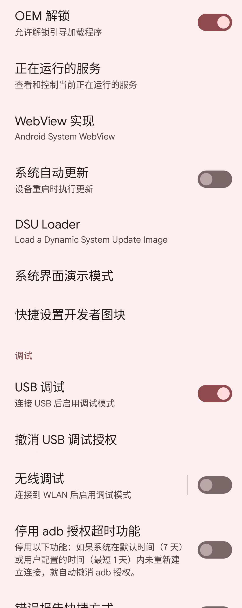
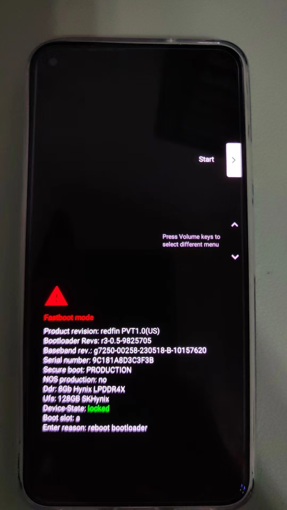
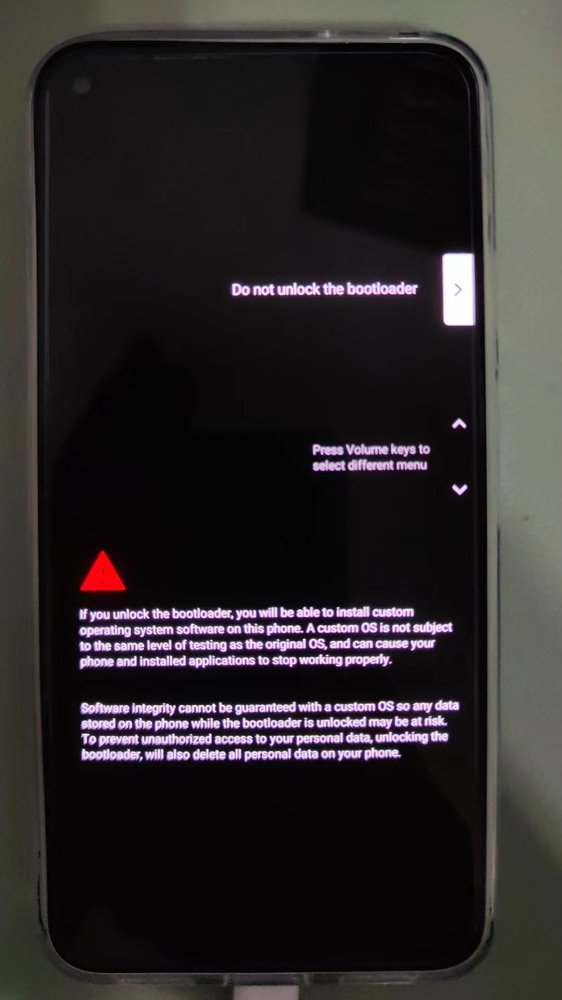
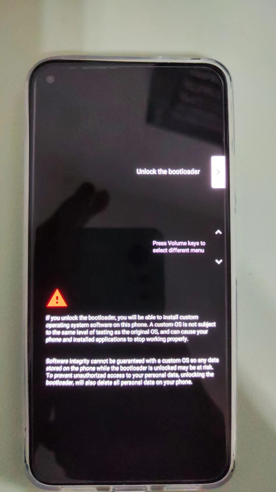
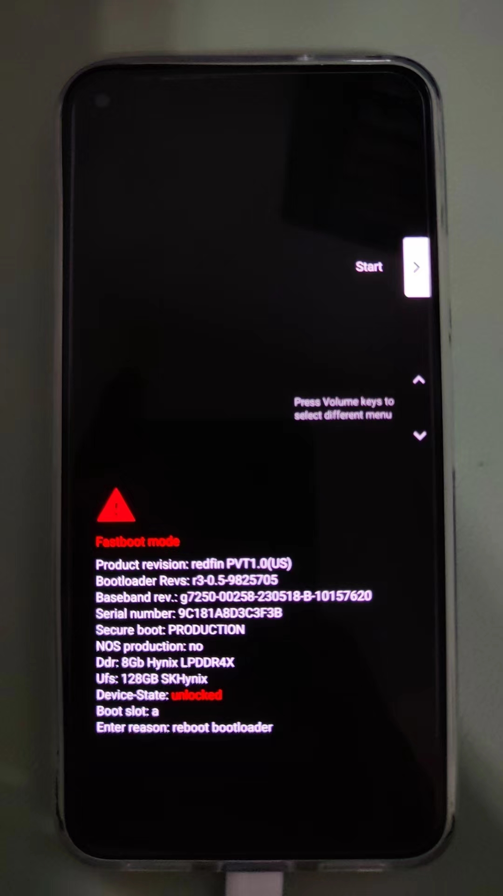
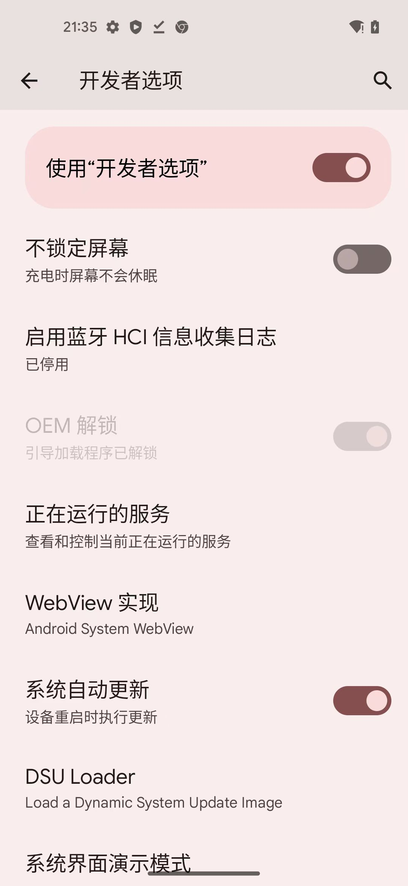
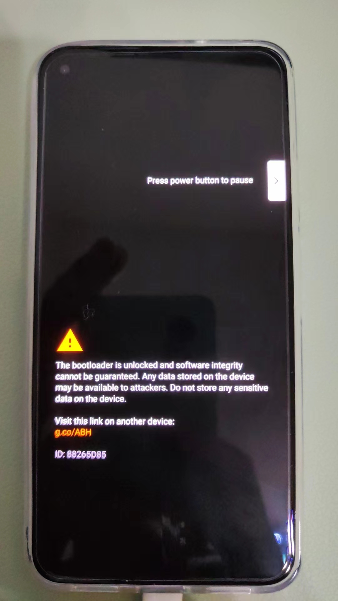

# 解锁Bootloader

先确保

* 系统`设置`->`开发者选项`->`设置`->已开启：`OEM解锁`
  * 

再去解锁`Bootloader`：

```bash
adb reboot bootloader
```

此时安卓手机会进入`Fastboot模式`，其中能看到`Device-State: locked`：



表示Bootloader未解锁

再去：

```bash
fastboot devices
```

确保能看到，处于的安卓手机设备：

比如：

```bash
➜  MagiskCoreAndApp fastboot devices
9C181A8D3C3F3B     fastboot
```
* 如果想要查看详情，可以加参数`-l`
  ```bash
  ➜  MagiskCoreAndApp fastboot devices -l
  9C181A8D3C3F3B         fastboot usb:1048576X
  ```

再去用：

```bash
fastboot flashing unlock
```

手机会进入Bootloader解锁页面：



按音量键加减，切换到：

`Unlock the bootloader`



再按`电源键`表示确认

会去重启安卓手机Pixel5，重启后再次进入了`Fastboot Mode`

会看到`Device-State: unlocked`



表示：Bootloader已解锁

然后：

```bash
fastboot reboot
```

会重启安卓手机


注：重启后

* 此时就相当于一个新的手机
  * 就像之前重刷了官网的Android13的ROM一样
    * -> 需要一步步初始化设置，直到进入系统桌面
  * 另外最好重新去：`开启USB调试`
    * 供后续开发调试用
* `系统`->`设置`->`开发者选项`->`设置`
  * `OEM解锁`：已经变成灰色了=不可勾选
    * 
  * -> 表示`已解锁`Bootloader了，无法再次点击开启
* 对于已解锁Bootloader的安卓手机（此处的Pixel5），后续每次重启时，都会有相关的提示`The bootloader is unlocked ...`
  * 
