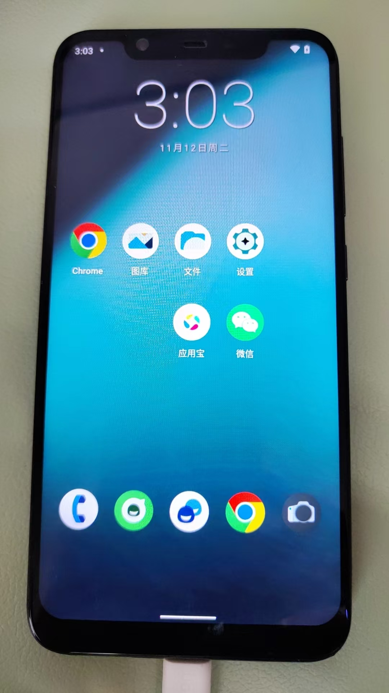
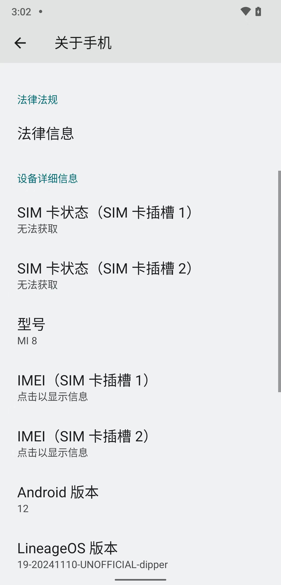

# 给LineageOS19的的小米8去root

此处有个：

刷机=ROM改机，为：`LineageOS 19`的`Android 12`的`小米8`：

* 小米8
  * 核心参数
    * LineageOS 19
    * Android 12
  * 图
    * 
    * 

去用（ 新版Magisk的）`小狐狸`=`狐狸面具`=`Kitsune Mask`去root。
