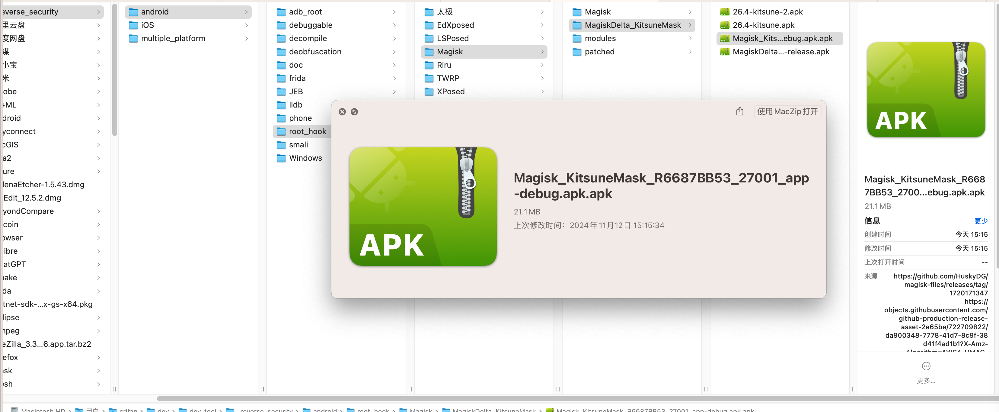
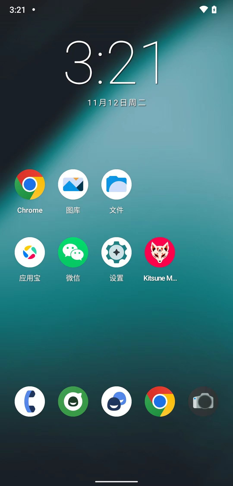
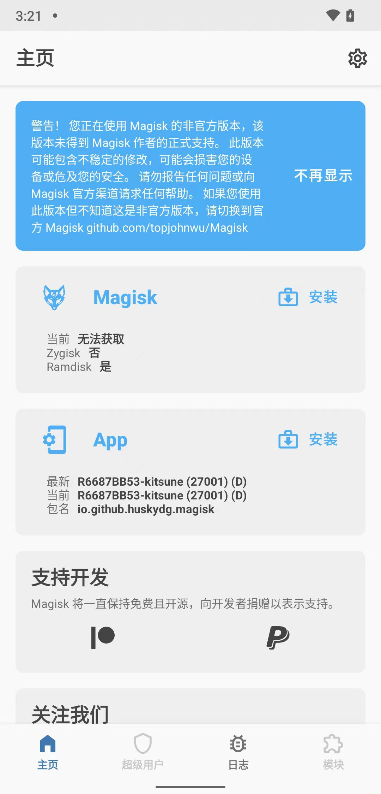
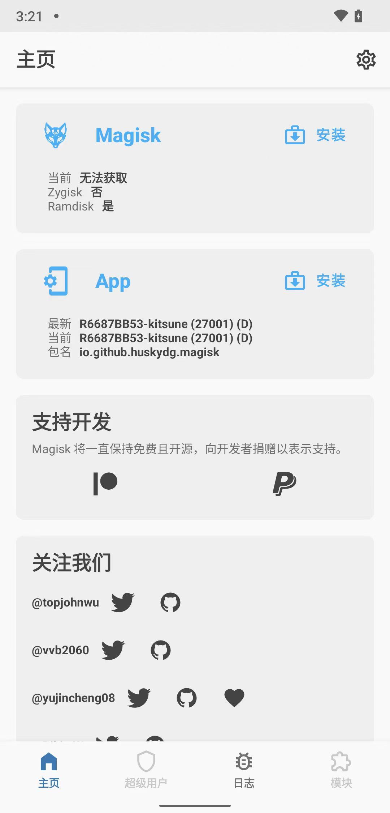

# 下载安装Kitsune Mask

## 下载Kitsune Mask

* （ 新版Magisk的）`Kitsune Mask`
  * 别称
    * `小狐狸`
    * `狐狸面具`
  * logo
    * 
  * 源码
    * https://github.com/KitsuneMagisk/magisk
  * 下载
    * 稳定版
      * https://github.com/HuskyDG/download/
        * v26.4 Stable
          * https://github.com/HuskyDG/download/raw/main/magisk/26.4-kitsune.apk
    * 最新版
      * https://github.com/HuskyDG/magisk-files
        * https://github.com/HuskyDG/magisk-files/releases/
            * 27001
              * https://github.com/HuskyDG/magisk-files/releases/tag/1720171347
                * debug版
                  * https://github.com/HuskyDG/magisk-files/releases/download/1720171347/app-debug.apk
                * release版
                  * https://github.com/HuskyDG/magisk-files/releases/download/1720171347/app-release.apk

下载任何一个版本均可

比如，此处下载了：

https://github.com/HuskyDG/magisk-files/releases/download/1720171347/app-release.apk

且改名为：

Magisk_KitsuneMask_R6687BB53_27001_app-debug.apk.apk



## 安装Kitsune Mask

```bash
adb install Magisk_KitsuneMask_R6687BB53_27001_app-debug.apk.apk
```

安装后，桌面中出现`Kitsune Mask`的图标：



## 打开Kitsune Mask

安装后，去打开：



点击：不再显示，后：



其中：

* `超级用户`和`模块`：是灰色的 == 不可点击的 == 表示含义：还没开启root权限
