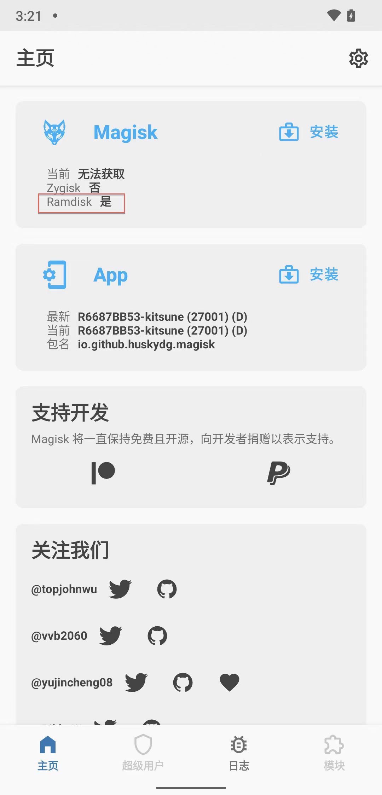
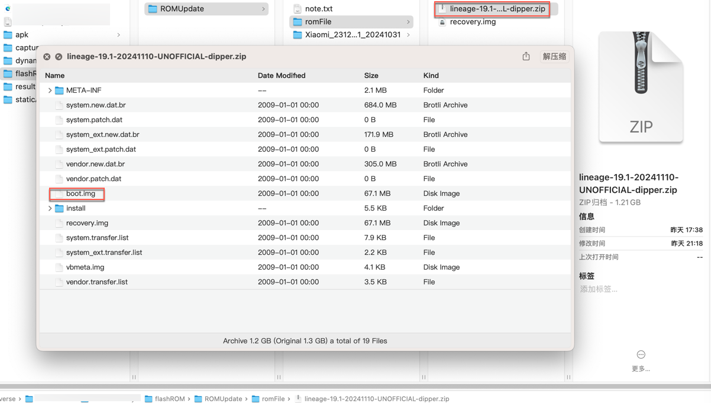
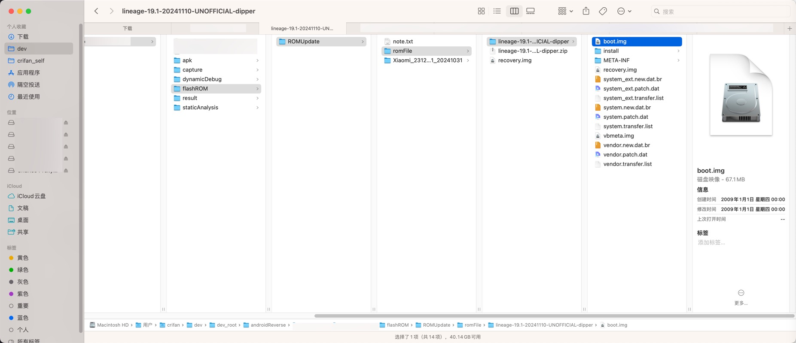

# 找到要打补丁的boot.img文件

## 要打补丁的文件是哪个文件

* 要打补丁的文件是哪个文件
  * 根据官网[Installation | Magisk](https://topjohnwu.github.io/Magisk/install.html)的解释，其实底层细节逻辑是：
  * 此处
    * Kitsune Mask中Magisk中：`ramdisk`=`是`
      * 
  * 表示：支持`Ramdisk`
  * 所以，要打补丁的文件，是：`boot.img`

## 到哪里找boot.img

去你的系统的镜像=image中，找对应的`boot.img`

而此处要打补丁的`boot.img`文件，是

之前（把`MIUI`的`小米8`）刷机为`LineageOS 19`时所用的ROM包：

* `lineage-19.1-20241110-UNOFFICIAL-dipper.zip`
  * 

去解压可以得到其中的：

* （`67.1MB`的）`boot.img`
  * 
