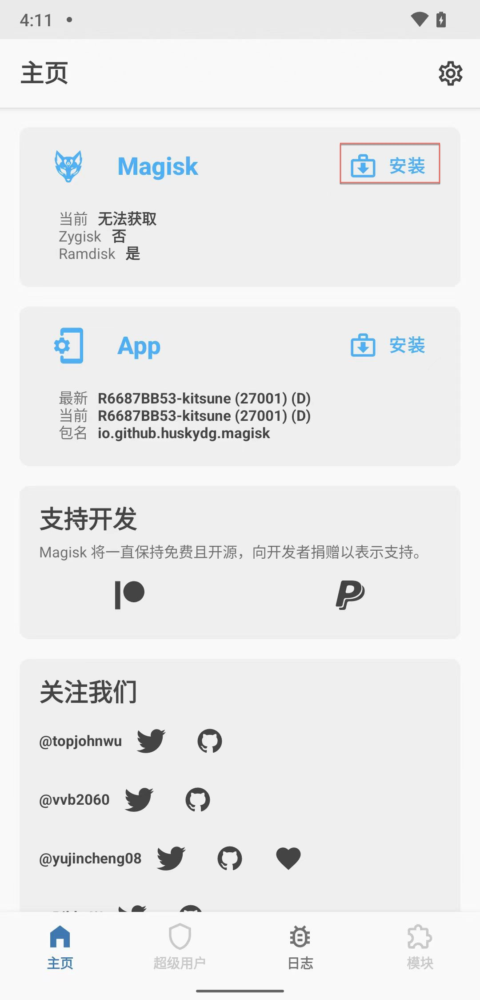
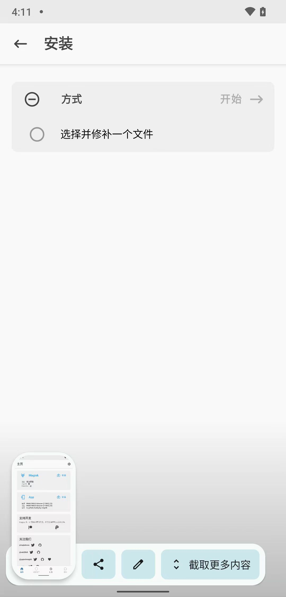
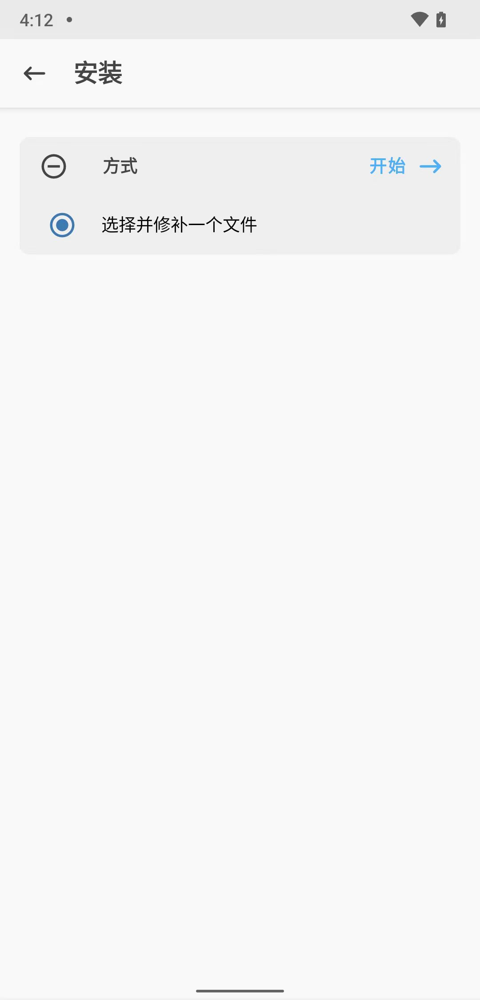
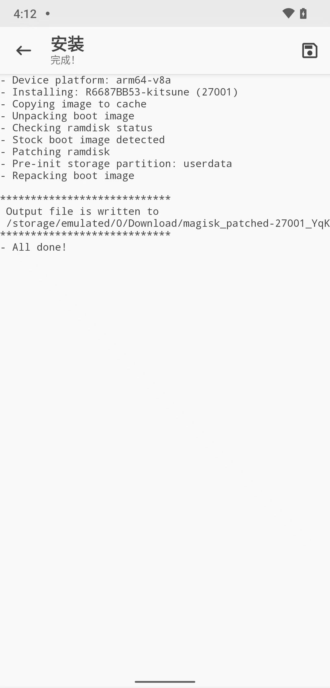
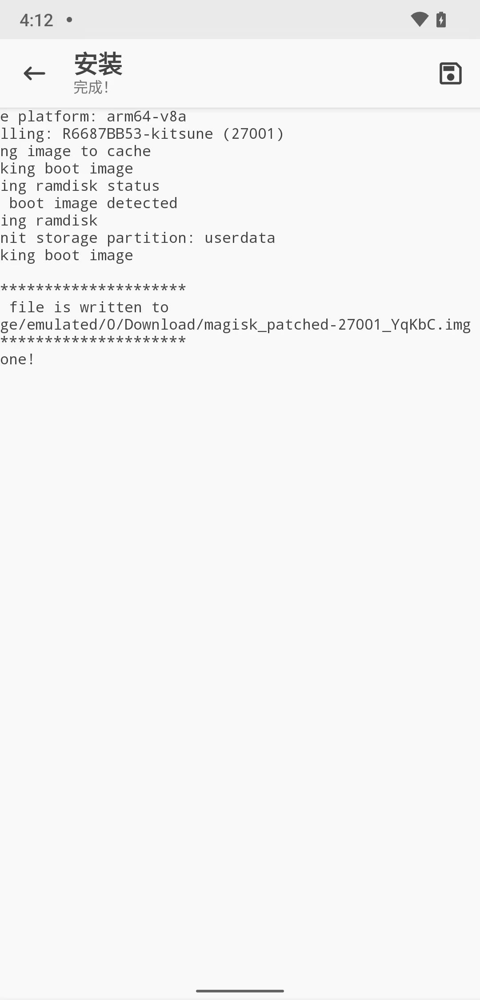

# 用Kitsune Mask去给boot.img打patch

此处：用Kitsune Mask去给boot.img打patch

和之前的：

[用Magisk去给boot.img打patch](../../phone_root/android_13_pixel_5/magisk_patch_boot_img.md)

的操作，其实可以说是：一模一样的

此处，仍记录细节过程，供参考：

---

把`boot.img`下载到安卓手机小米8中：

```bash
➜  lineage-19.1-20241110-UNOFFICIAL-dipper adb push boot.img /sdcard/Download/
boot.img: 1 file pushed, 0 skipped. 106.8 MB/s (67092480 bytes in 0.599s)
```

去小米8中打开`Kitsune Mask`：

点击`Magisk`的：`安装` （注意：不是`App`的`安装`）：

* 

点击：`选择并修补一个文件`：



弹框选择（之前已从电脑端下载到手机端下载目录中的）文件：`boot.img`：


已选择了`选择并修补一个文件`，点击`开始->`



开始安装过程，显示进度日志。最后显示`All done`，表示完成：





可以看到输出的文件 = 打了补丁的`boot.img`文件是：

`/storage/emulated/0/Download/magisk_patched-27001_YqKbC.img`

去看看文件细节：

```bash
dipper:/ $ cd /sdcard/Download/
dipper:/sdcard/Download $ ll
/system/bin/sh: ll: inaccessible or not found
127|dipper:/sdcard/Download $ ls -lh
total 128M
-rw-rw---- 1 root everybody 64M 2009-01-01 00:00 boot.img
-rw-rw---- 1 root everybody 64M 2024-11-12 16:12 magisk_patched-27001_YqKbC.img
```

继续上传到PC电脑端：

```bash
➜  magisk_kitsuneMask_root adb pull /sdcard/Download/magisk_patched-27001_YqKbC.img .
/sdcard/Download/magisk_patched-27001_YqKbC.img: 1 file pulled, 0 skipped. 35.7 MB/s (67092480 bytes in 1.795s)
➜  magisk_kitsuneMask_root ll
total 131456
-rw-r--r--  1 crifan  staff    64M 11 12 16:25 magisk_patched-27001_YqKbC.img
```

供下一步 [用Kitsune Mask写入patch后的boot.img](../../phone_root/lineageos_19_xiaomi8/write_patched_boot_img/README.md) 去使用。
