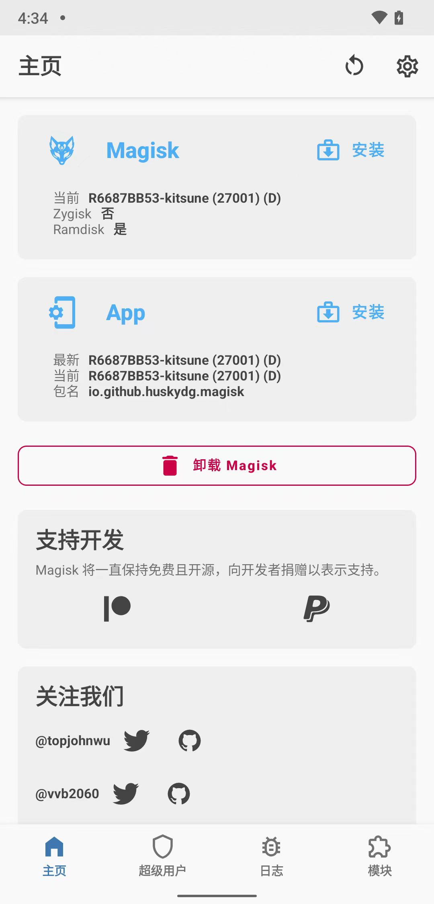
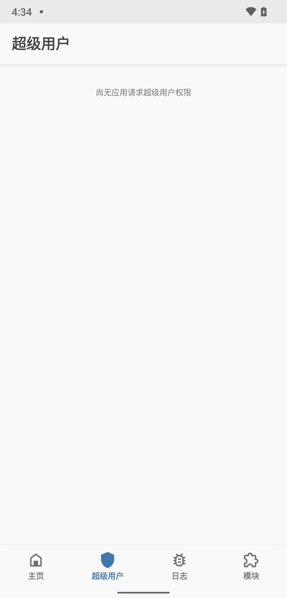
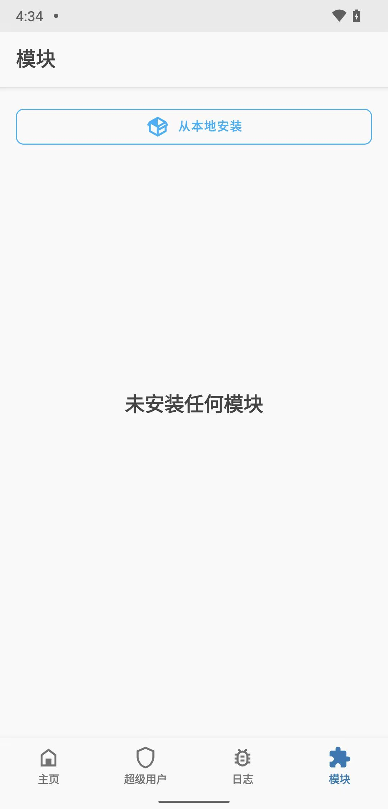
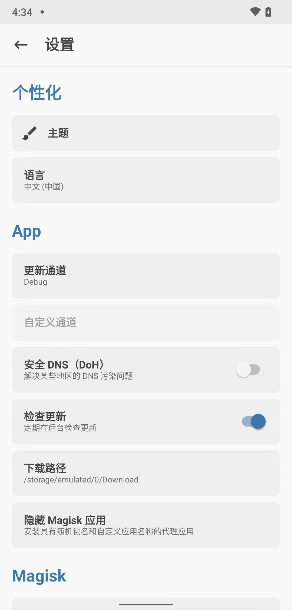
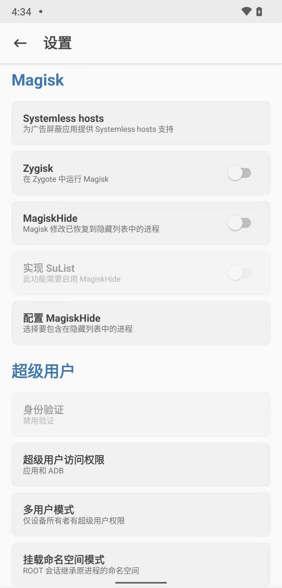
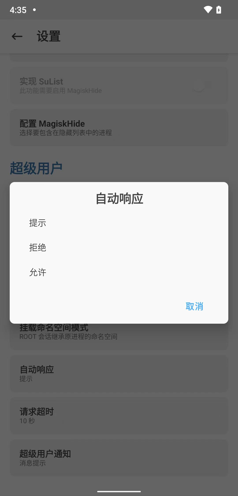
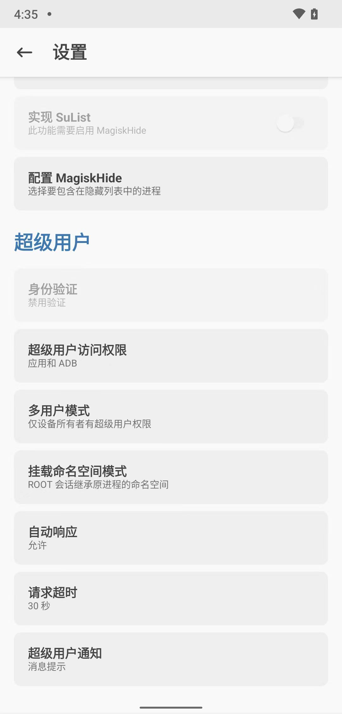
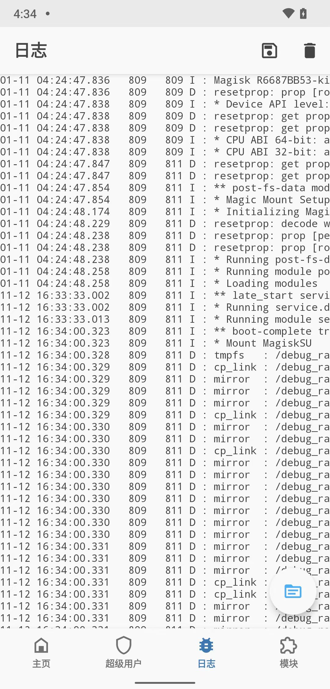
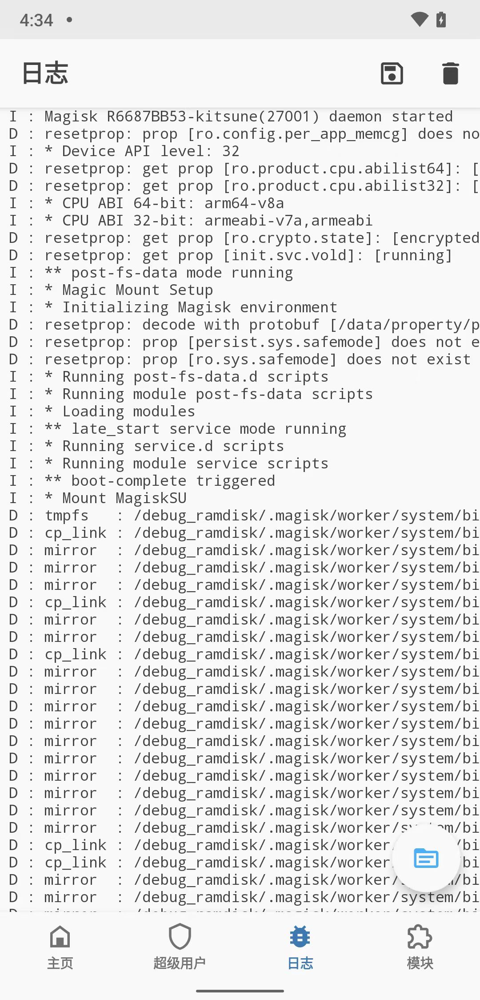
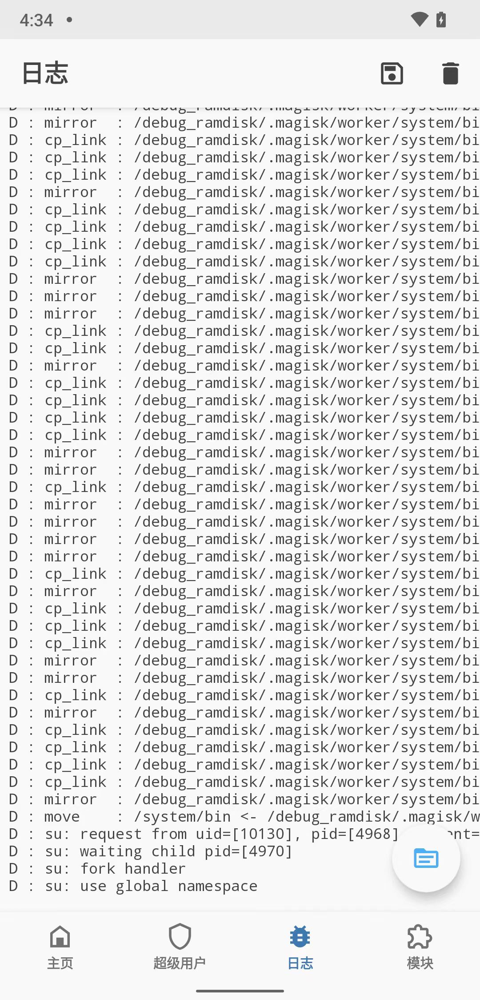

# Kitsune Mask中root相关设置

同理，`Kitsune Mask`和`Magisk`中的配置和逻辑：

[Magisk中root相关设置](../../phone_root/android_13_pixel_5/magisk_root_config.md)

几乎一样。

但也还是再仔细介绍一下：

---

正常进入已root后的`Kitsune Mask`的界面是：

常规的逻辑和功能：

## 如何判断是否已经root成功？

`超级用户`和`模块`：不是灰色，是白色，且可以点击，表示：已获取了root权限

## 超级用户

* `超级用户`
  * 

## 模块

* `模块`
  * 

## 设置

* 设置
  * 进入方式：点击`Kitsune Mask`主页的右上角**齿轮⚙**按钮
  * 默认的一些设置
    * 
    * 
    * 

### 改动一些配置

* 自动响应
  * 之前：`提示`
    * 图
      * 
    * 效果和逻辑：别人应用申请获取root后，此处会弹框提示，需要用户手动点击允许，才能真正获取root权限 =》比较麻烦
  * 现在改为：`（自动）允许`
    * 图
      * 
    * 效果和逻辑：别人应用申请获取root后，自动就同意，无需用户手动同意，更加方便

## 日志

* 日志
  * 
  * 
  * 
