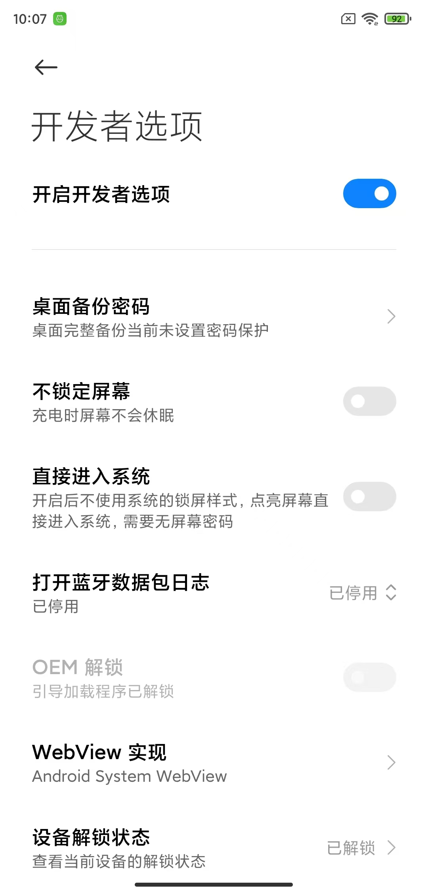
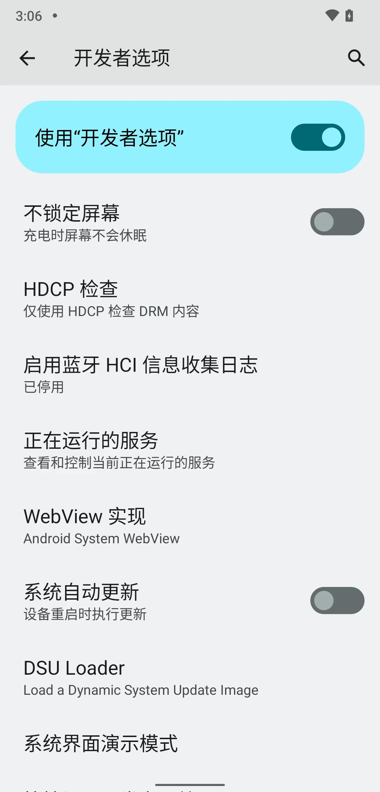

# 解锁Bootloader

此处，按理说，应该也去参考：

普通的安卓手机去root之前的：

[解锁Bootloader](../../phone_root/android_13_pixel_5/unlock_bootloader.md)

不过，此处有点点特殊：

* 原先二手已root小米8
  * 开发者选项中有：OEM解锁 -》 且已解锁
    * 注：网上买二手时，卖家已帮忙实现 BL解锁
    * 图
      * 
* 但是后来把`MIUI`的小米8刷机为`LineageOS`后
  * 开发者选项中（竟然）：没有OEM解锁
    * 感觉是：无需OEM解锁，所以算：已解锁
    * 图
      * 
