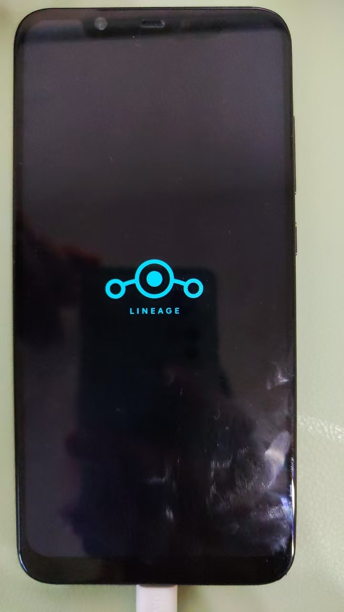
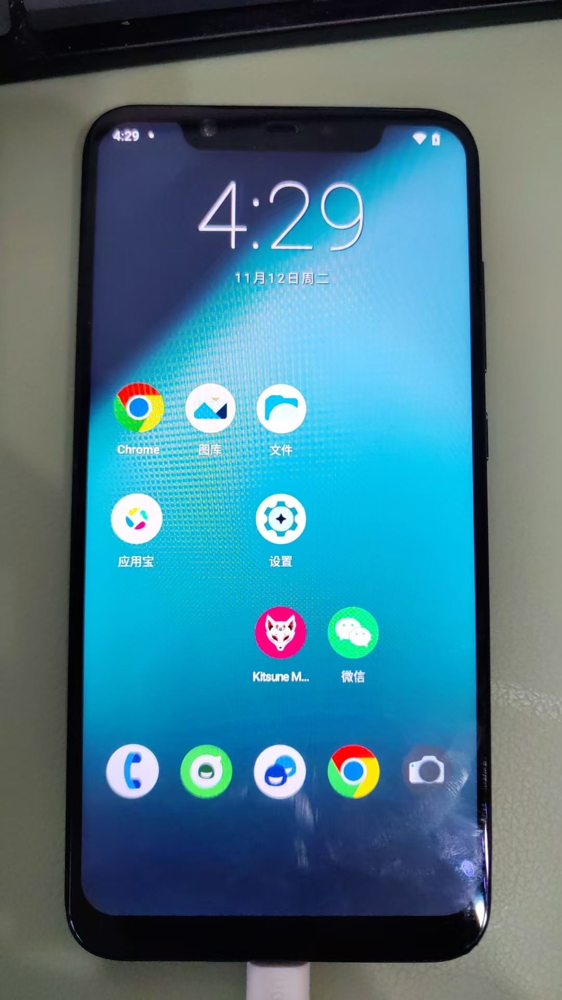
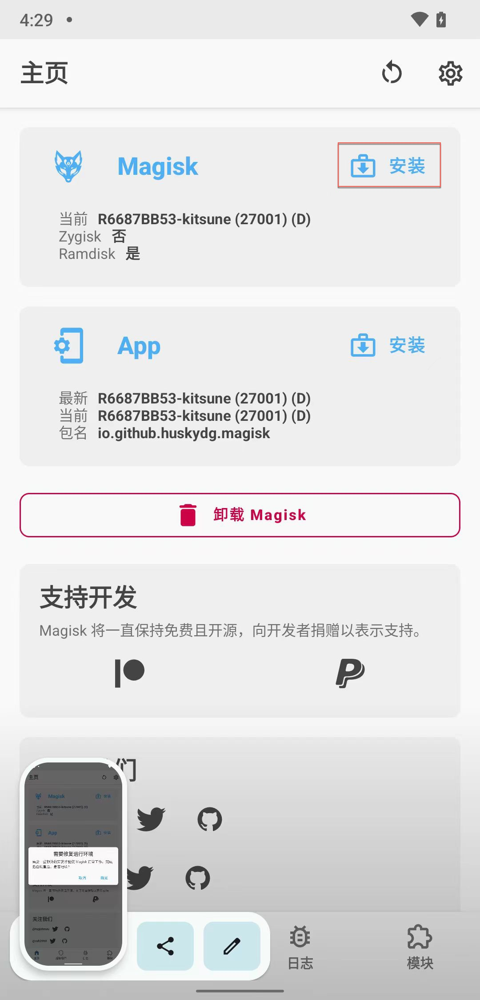
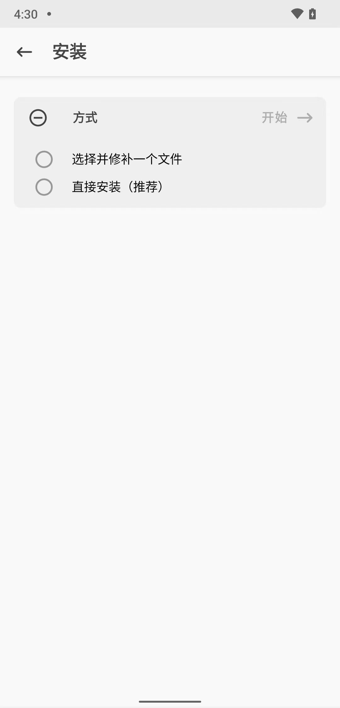
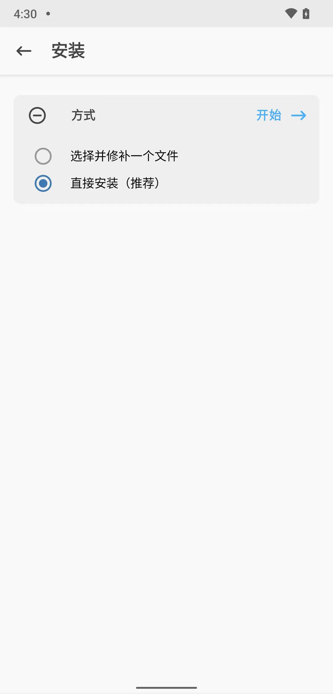
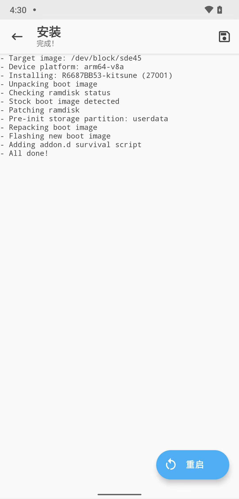

# 用Kitsune Mask写入patch后的boot.img

此处的：用Kitsune Mask写入patch后的boot.img

其实也是和之前的：

[用Magisk写入patch后的boot.img](../../phone_root/android_13_pixel_5/magisk_write_patched_boot_img.md)

的操作：一模一样。

但是也是额外记录此处细节，供参考：

---

## 进入Bootloader模式

电脑端：

```bash
adb reboot bootloader
```

此时小米8手机中进入`FASTBOOT`界面：


再去用`fastboot devices`确认：

```bash
➜  magisk_kitsuneMask_root fastboot devices
f97a0408     fastboot
```

## 写入打了补丁后的boot.img文件

然后继续去用`fastboot boot magisk_patched-27001_YqKbC.img`写入（之前打了补丁的）`boot.img`文件：

效果：

```bash
➜  magisk_kitsuneMask_root fastboot boot magisk_patched-27001_YqKbC.img
Sending 'boot.img' (65520 KB)                      OKAY [  1.516s]
Booting                                            OKAY [  0.050s]
Finished. Total time: 1.580s
```

## 手机自动重启

然后手机端小米8会重启：



重启后，进入桌面：



## 进入Kitsune Mask

打开`Kitsune Mask`：

* 此时往往要去注意和处理：
  * [弹框：需要修复运行环境](../../../phone_root/lineageos_19_xiaomi8/write_patched_boot_img/popup_need_fix_env.md)

继续点击`Magisk`后面的`安装`：



## 直接安装

点击：`直接安装（推荐）`



已勾选`直接安装（推荐）`，点击：`开始->`



## 再次重启手机

开始安装过程。稍等几十秒后，完成。点击按钮：`重启`


