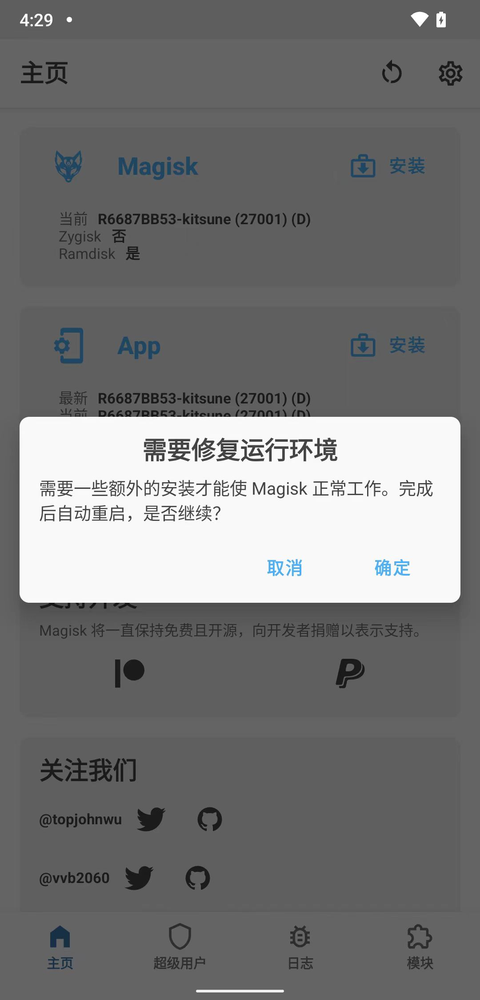

# 弹框：需要修复运行环境

* 概述
  * 对于`需要修复运行环境`，点击`取消` 
    * 注意：**不要点击**`确定`

下面是详细解释：

---

对于刚用：

```bash
fastboot boot magisk_patched-27001_YqKbC.img
```

写入打了补丁的`boot.img`后（手机重启后），再去打开`Kitsune Mask`时，往往会遇到一个稍微特殊点的情况：

会出现弹框提示：`需要修复运行环境`

```bash
需要修复运行环境
需要一些额外的安装才能使Magisk正常工作。完成后自动启动，是否继续
取消
确定
```



【总结】

根据实测的经验：

* Kitsune Mask
  * 不论是之前的，最新版，测试版，不是稳定版：`R65C33E4F-kitsune (27001)`
  * 还是官网推荐的，最新的稳定版：`26.4-kitsune (26400)`

对于，如果用fastboot去启动patch后的boot.img：

```bash
fastboot boot magisk_patched-27001_O2xja.img
```

（重启后）然后：

启动Kitsune Mask：都会出现：

* 需要修复运行环境
  * 需要一些额外的安装才能使Magisk正常工作。完成后自动重启，是否继续？
    * 取消 确定

这个弹框，而：

* 如果点击：`确定` => 就会导致（期望的，已经获取到的，临时的）**root权限丢失掉**
  * 超级用户 和 模块：2个tab按钮，灰色，不可点击
    * 后续也就无法正常root流程了
* 应该是点击：`取消` => 忽略这个提示 => 即可实现：（临时的）**root权限得以保留**
  * 此时：`超级用户`和`模块`：2个tab按钮，是白色的，可点击的
  * 然后继续后续步骤：
    * [用Kitsune Mask写入patch后的boot.img](../../../phone_root/lineageos_19_xiaomi8/write_patched_boot_img/README.md)
  * 即可顺利完成root
