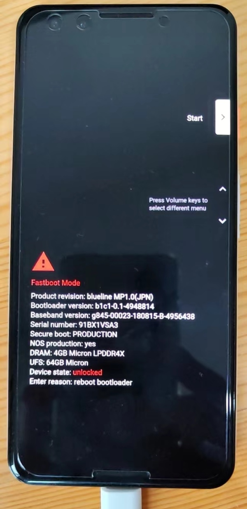

# fastboot mode

TODO：

* 【已解决】安卓手机什么是fastboot mode
* 【未解决】Android 8.1的OPPO R11s无法进入bootloader的fastboot mode

---

* `fastboot mode`
  * =`刷机模式`=`bootloader mode` = `download mode`=`下载模式`
  * 长什么样
    * Google Pixel 3
      * 
