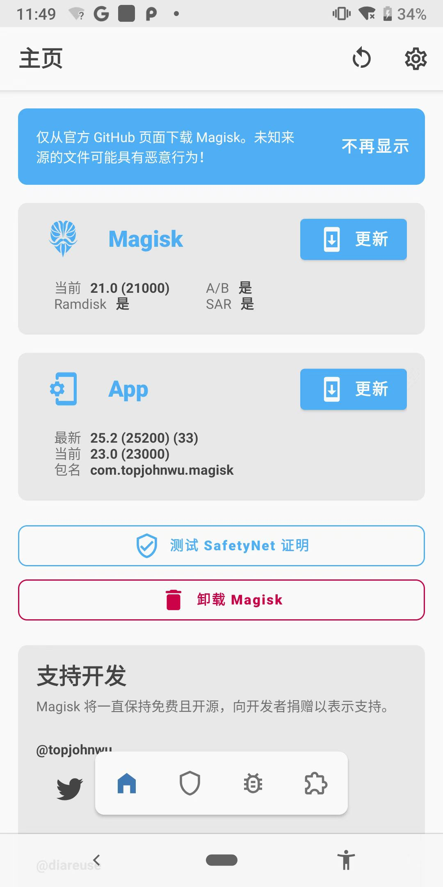
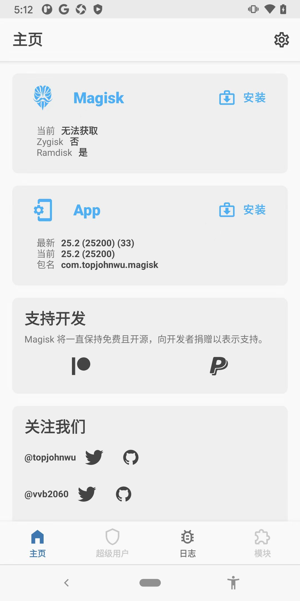

# Magisk

TODO：

* 【未解决】给OPPO R11s开启root权限：用非TWRP的Recovery模式安装刷入Magisk
* 【总结】Magisk Manager使用心得：root超级用户权限管理
* 【整理】安卓root工具：Magisk
* 【已解决】OPPO R11s中安装Magisk并给boot.img打补丁
* 【已解决】Magisk中安装中去Patch启动镜像boot.img
* 【记录】已root的Google Pixel3中的Magisk相关信息
* 【记录】OPPO R11s中Magisk Manager初始化和配置参数
* 【记录】root安卓手机OPPO R11s中升级Magisk Manager
* 【已解决】OPPO R11s中Magisk Manager升级后提示：不支持的Magisk版本
* 【整理】Google Pixel3中的Magisk Manager使用心得
* 【记录】手动下载和升级Magisk到最新版本
* 【记录】Magisk Manager版本升级
* 【未解决】Magisk Manager模块从本地安装无法识别选择apk文件

---

* Magisk
  * 新版：`v21`
    * 
  * 最新版：`v25`
    * 

## 新版Magisk中没有模块的在线搜索了

TODO：

* 【未解决】新版Magisk中没有在线搜索安装模块了

## Zygisk

TODO：

* 【已解决】Magisk中的：Zygisk
